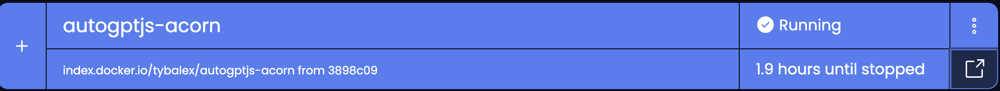

<div align="center">

# AutoGPT.js

[](https://acorn.io/run/index.docker.io/tybalex/autogptjs-acorn?ref=tybalex)

AutoGPT.js is an app to try out AutoGPT in your browser.

</div>

## Prerequisites

* an openAI key

## Deploy the App

You can deploy the app on the Acorn SaaS platform with the following simple steps:

1. Login into the [Acorn SaaS Platform](https://beta.acorn.io/) using the Github Sign-In option with your Github user.
2. Select the "Create Acorn" option.
3. Choose the source for deploying your Acorns
  * Select "From Acorn Image" to deploy the inference server and select its Image
  * Provide any random name such as `autogptjs` and keeping Project's default Region, type in the below Acorn image and choose Create 
    ```bash
    index.docker.io/tybalex/autogptjs-acorn
    ```
  * Note that this app could take a few minutes to be deployed.
4. Now the app is provisioned on Acorn SaaS Platform and is available for 2hrs. Upgrade to pro account to keep it running longer.
5. Once the Acorn is running, you can hit the button at bottom right corner and start to explore autoGPT in your browser! 


### Deploy thru CLI

```bash
acorn run index.docker.io/tybalex/autogptjs-acorn
```


## About the raw project
AutoGPT.js is an open-source project that aims to bring the powerful capabilities of AutoGPT to your browser. By running directly in the browser, AutoGPT.js offers greater accessibility and privacy.

Visit [AutoGPTjs.com](https://autogptjs.com)
