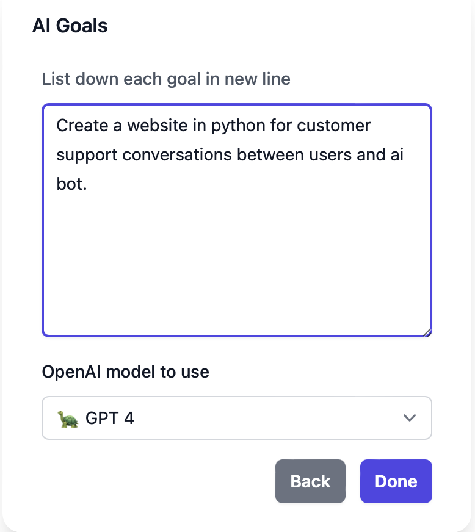

# AutoGPT.js Tutorial: Bringing AutoGPT to Your Browser

## Introduction
AutoGPT.js is a project that allows users to seamlessly run AutoGPT directly in their browsers. AutoGPT is an open-source Python application built on the foundation of GPT-4. It is designed to automate the execution of tasks based on human instructions and can perform tasks like creating websites, writing articles, and developing marketing strategies. Unlike ChatGPT, AutoGPT can execute larger tasks without the need for repeated guidance, making it more autonomous.

### Why AutoGPT.js?
* Easy access to powerful Autonomous AI in browser 
* Goal-Oriented Assistance: Set a goal, and let AutoGPT assist you in achieving it, whether it's planning a trip or writing a research paper.
* Local File Access: Work with your local files without the need to upload them elsewhere.
* Code Generation: Receive code suggestions and samples as you type or based on your goals.
* Web Search Functionalities: Harness the capability of web searches right from within your browser.

## Step-by-Step Guide
In this tutorial, we'll guide you through the steps to deploy and launch the app using Acorn. Additionally, we'll show you how to get started with AutoGPT.js, accompanied by a practical example.

### Deployment & Launch Options:
Deploy and launch your smart AI assistant by selecting how you deploy the app. There are a few options:

1. Using Acorn UI to deploy with one of the following options:

- (Recommanded) The suggested solution, because it's so easy. Navigate to https://beta.acorn.io/tybalex/acorn/run/index.docker.io/tybalex/autogptjs-acorn?ref=tybalex and click "Deploy". That's it!
- Navigate to the Acorn SaaS Platform and sign in. Hit the "Deploy Acorn" button, select "From Acorn Image". Fill "Acorn Image" with `index.docker.io/tybalex/autogptjs-acorn`, and hit "Deploy". 

Once the deployment is ready, you should see something like this:

hit the icon on bottom right to navigate to the browser and get started using AutoGPT!


2. Using Acorn CLI

Run the following command (assuming you've already logged in using `acorn login acorn.io` ):
```
acorn run index.docker.io/tybalex/autogptjs-acorn
```

You should see something like this once the deployment is success:
```
┌─────────────────────────────────────────────────────────────────────────────────────────────┐
| STATUS: ENDPOINTS[https://muddy-haze-9e20c935.qactc6.on-acorn.io] HEALTHY[1] UPTODATE[1] OK |
└─────────────────────────────────────────────────────────────────────────────────────────────┘
```
now you can visit the endpoint in a browser to get started.


### Getting Started with AutoGPT.js
* Prerequisites:
    - Have your OpenAI API key ready. You'll need this to authenticate and access the features of AutoGPT.
    - A web browser. 

1. Navigate to the AutoGPT.js user interface in your browser.

2. You will find an box to input the openAI key. Simply paste your openAI key starts with `sk-xxxx` and hit "Start". If you don't have a key yet, you will need to go to [https://openai.com](https://openai.com) create an account and generate a key.


3. Name your AI and give it a role. In this example, we are creating an website AI coder to help us create websites.


4. Set the goal for the AI. The goal can range from simple tasks to complex queries. For instance:
- "Help me plan a trip to Hawaii."
- "Assist me in creating a Python script for data visualization."
- "Find the best recipes for a vegan dinner."

In this example, we are telling the AI to write python codes to create a website. You can select which openAI model to use. Here we will use GPT-4.


5. After setting your goal, AutoGPT will automatically start working on it, providing you with plans, execution results, etc...


### Behind the Scenes – Acornfile
The power of one-click deployment comes from the acornfile. Acornfile sits atop the [dockerfile of the original project](https://github.com/zabirauf/AutoGPT.js/blob/main/Dockerfile) and simplifies the deployment process on cloud environment. 
Let's take a look at the acornfile used in this tutorial:

```
containers: {
  app: {
    image: "tybalex/autogptjs"
    ports: publish: "8080/http"
    memory: 1024Mi
  }
}
```
Basically, in this acornfile, we use the docker image built from the dockerfile of original project, expose port 8080 for public access, and request 1024 Mi of memory. 

To run this acornfile, create a new directory and paste the above acornfile to a file named `Acornfile`, then run the following command:
```
acorn login
acorn run -n autogptjs .
```

## Conclusion
AutoGPT.js is designed to offer an intuitive, user-friendly interface coupled with the robust capabilities of AutoGPT. By following this tutorial, users can effortlessly deploy and access and utilize AI from their web browsers empowered by Acorn, making tasks like code generation, web search, and local file access more efficient and effective. Explore the world of opportunities unlocked by AutoGPT.js, where AI is not just a tool but a companion in achieving your objectives.